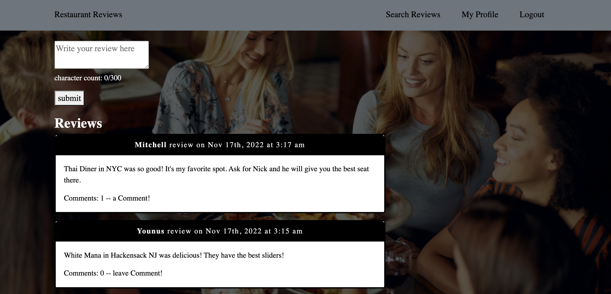
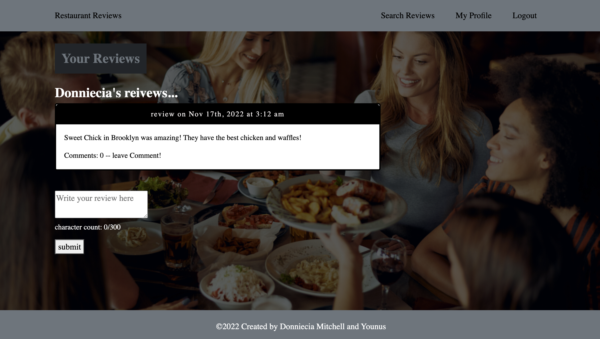

## Project 3 - Restaurant Reviews
## Summary  
For this Project, we created an app for a user to be able to share their restaurant reviews. Chosing a restuarnt shouldn't be complicated and with this app we make it easy to share your reviews, save them on your profile and be able to share and view your reviews with your friends and family all in one place. Deciding on your next restaurant will be so much easier with "Restaurant Reviews"

# Table of Contents 
* [Summary](#Summary)
* [Technology](#Technology)
* [Image](#Image)
* [Heroku](#Heroku)
* [About](#About)

## React for the front end.
* GraphQL API with a Node.js and Express.js server 
* MongoDB and the Mongoose ODM for the database and protects sensitive API key information on the server.
* User authentication using JWT.

## Image 

## Heroku 
Here is the link to Heroku: https://shrouded-taiga-00254.herokuapp.com/

## About
This app was created by Donniecia Mitchell and Younus 